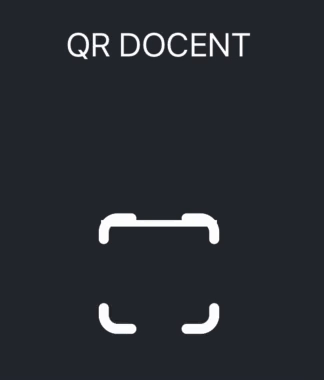
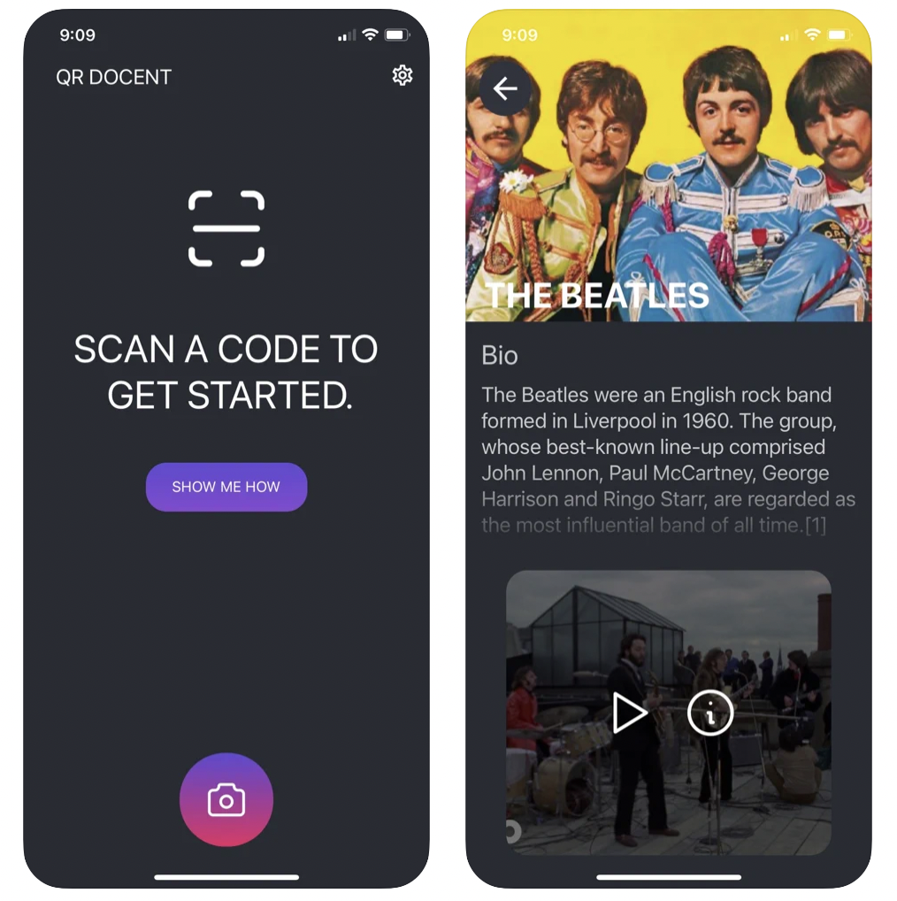
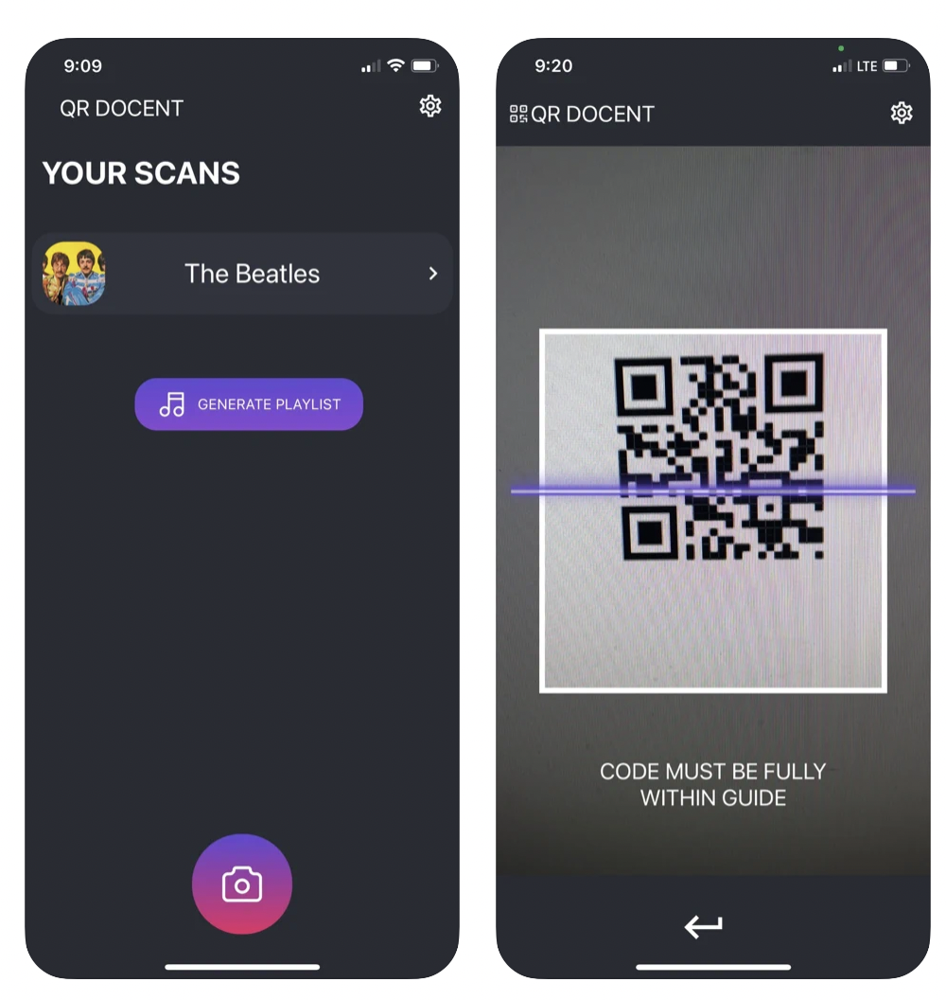

# QR Docent: Mobile App 
<p align="center">A MUSEUM GUIDE FOR THE 21ST CENTURY</p>
<br/>
<br/>
<p align="center" width="100%">
    
</p>
<br/>
<br/>

<p align="center">
    <a href="https://apps.apple.com/us/app/qr-docent/id1594267050">
        
    </a>
</p>

<p align="center">
    <a href="https://play.google.com/store/apps/details?id=com.danteedmonson.qrdocent">
        
    </a>
</p>


## Table of Contents
* [Introduction](#introduction)
* [Technologies Used](#technologies-used)
* [Features](#features)
* [Screenshots](#screenshots)
* [Usage](#usage)
* [Project Status](#project-status)
* [Contact](#contact)
<!-- * [License](#license) -->

<br/>

## Introduction
- ### Problem
    ```
        When a user goes to a museum the may not be engaged during or after their visit. In this new era of technology it's time to introduce these ideas into museums for the next generation.
    ```
- ### Purpose
    ```
        The purpose of QR Docent is to lets users make custom Spotify playlists so they can listen to the music they loved from museums again and again. They can simply scan an exhibit's QR code using the app, and a curated list of songs related to that exhibit will be added to a playlist for them.
    ```
        
- ### Why 
    ```
        We want QR Docent to provide visitors interesting and relevant content on their own smartphone that they can take home with them after their visit. This personalized list of interactive content will be impactful and keep visitors engaged during their visit.
    ```
<!-- You don't have to answer all the questions - just the ones relevant to your project. -->

<br/>

## Technologies Used
- React - version 17.0.2
- React Native - version 0.63.4
- PostgreSQL - version 14.1.0
- NodeJS - version 14.16.1
<br/>

## Features
- Create Playlist: Create a custom spotify playlist of the user scans
- Scan QR codes: Scan QR codes to add exhibits to the users list
- Exhibit Information: Each exhibit comes  with different content cards 
<br/>

## Screenshots

<p align="center" width="100%">
    
</p>
<br/>
<br/>
<br/>


<p align="center" width="100%">
    
</p>
<br/>
<br/>
<br/>


## Usage

```bash
# Clone this repository
$ git clone https://github.com/Mayank-Patel1/QRdocent

# Go into the repository
$ cd mobile-app

# Install dependencies
$ yarn 

# Run the app
$ expo start 
```

<br/>

## Project Status
Project is:   _complete_  


<br/>

## Contact
Created by [@danteedmonson](https://github.com/danteedmonson) and [@mayankpatel](https://github.com/Mayank-Patel1)


<!-- Optional -->
<!-- ## License -->
<!-- This project is open source and available under the [... License](). -->

<!-- You don't have to include all sections - just the one's relevant to your project -->